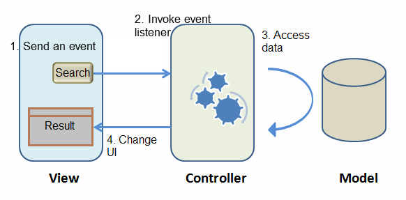
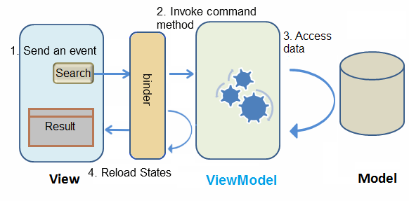

# Approach Comparison

The interaction picture at left side is MVC, and the one at right side
is MVVM. The main differences are that Controller changes to ViewModel
and there is a binder to synchronize data instead of a Controller in
MVVM .

    

    MVC
    

MVVM

Both approaches can achieve many things in common, but there are still
some differences between them. Each of two approaches has its strength.
Building an application with MVC approach is more intuitive, because you
directly control what you see. Its strength is that you have total
control of components, so that you can create child components
dynamically, control custom components, or do anything a component can
do.

In MVVM, because ViewModel is loosely-coupled with View (it has no
reference to components), one ViewModel may associate with multiple
Views without modification. UI designers and programmers may work in
parallel. If data and behavior do not change, a View's change doesn't
cause ViewModel to be modified. In addition, as ViewModel is a POJO, it
is easy to perform unit test on it without any special environment. That
means ViewModel has better reusability, testabiliby, and better
resistance against View change.

To summarize, a comparison table is illustrated below:

| MVC | MVVM
---------------------------|----------------|------
 Coupling with View        | Loose with layout | Loose
 Coupling with Component   | Tight          | Loose
 Coding in View            | Component ID   | Data binding expression
 Controller Implementation | Extends ZK's composer |  a POJO
 UI Data Access            | Direct access  |  Automatic
 Backend Data Access       | Direct access  | Direct access
 UI Updating               | Manipulate components  |  Automatic(@NotifyChange)
 Component Controlling Granularity          |  Fine-grained  | Normal
 Performance               | High           | Normal

