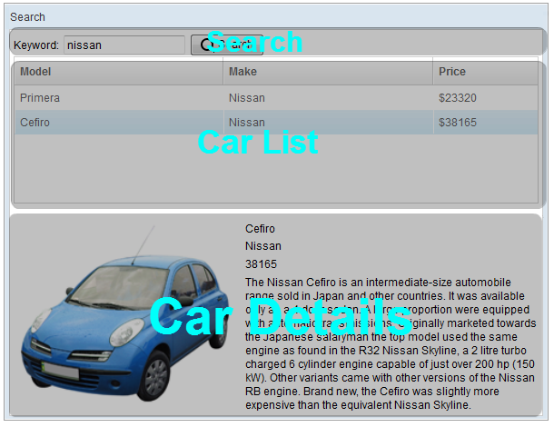

# Building the User Interface

UI Design is a good start to building an application as it helps you
define the scope of your application. ZK provides hundreds of readily
made UI components so developers can rapidly build their desired user
interface by combining and mix matching these components without having
to create them from scratch.

In ZK, you can use ZK User Interface Markup Language (ZUML) [^1], an
XML-formatted language, to describe UI. By ZK's convention, the files to
describe user interface with ZUML uses **.zul** as the name suffix. In
zul files, one component can be represented as an XML element (tag) and
you can configure each component's style, behavior, and function by
setting XML element's attributes.[^2]

In the case of this example application, first of all, we want to design
a *window* with the specified title and normal border as our
application's frame.

**Extracted from search.zul**

```xml

    <window title="Search" width="600px" border="normal">
        <!-- put child components inside a tag's body -->
    </window>
```

As *window* is the outermost component, it is called the *root
component*. *Window* is a commonly used container because it is a basic
display element of a desktop-like application while it can also enclose
other components. All other components inside *window* are called its
*child components* and should be put in window tag's body. We set
*window*'s title bar text with "title" attribute and make *window*
display a normal border with "border" attribute. For "width" attribute,
use CSS like syntax such as "800px" or "60%".

Basically, our example application's user interface is divided into 3
areas within the *window*, they are (from top to bottom) search
function, car list, and car details.



**Search Area:** ZK components are like building blocks, you can combine
and mix-match existing components to construct your desired UI. To allow
users to search, we need a text to prompt users for input, a place to
enter keywords, and a button for triggering the search. We can use the
following ZK components to fulfill this requirement:

**Extracted from search.zul**

``` xml

        <hbox align="center">
            Keyword:
            <textbox id="keywordBox" />
            <button id="searchButton" label="Search" image="/img/search.png" />
        </hbox>
```

`hbox` is a layout component that arranges its child components
horizontally and you can probably guess by now that the **h** represents
*horizontal*. As these child components have different heights, we set
the "align" attribute to "center" so they are aligned neatly along their
center line. Here we also specify an "id" attribute for some components
which allow you to control them by referencing their *id*. You can also
easily create an image button by specifying the path for the "image"
attribute.

**Car List Area.** ZK provides several components to display a
collection of data such as *listbox*, *grid*, and *tree*. In this
example, we have chosen to use a *listbox* to display a list of cars
with 3 columns: Model, Make, and Price. We set the "height" attribute,
so the number of rows visible is limited with respect to the height
specified; you can drag scroll-bar to see the rest of rows. The
"emptyMessage" attribute is used to show a message when *listbox*
contains no items. The *listbox* is a container component, and you can
add *listhead* to define a column. The *listitem* is used to display
data, and the number of *listcell* in one *listitem* should equal to the
number of *listheader*. Here we use *listcell* with static label to
demonstrate structure of a *listitem*, and we'll talk about how to
create *listitem* dynamically with respect to each data object in the
next chapter.

**Extracted from search.zul**

```xml
        <listbox id="carListbox" height="160px" emptyMessage="No car found in the result">
            <listhead>
                <listheader label="Model" />
                <listheader label="Make" />
                <listheader label="Price" width="20%"/>
            </listhead>
            <listitem>
                <listcell label="car model"></listcell>
                <listcell label="make"></listcell>
                <listcell>$<label value="price" /></listcell>
            </listitem>
        </listbox>
```

**Car Details Area.** Like the *hbox*, *vbox* is also a layout component
which arranges its child component in vertical order. By combing these 2
layout components, we can present more information on a screen. The
"style" attribute allows you to customize component's style with CSS
syntax.

**Extracted from search.zul**

```xml
        <hbox style="margin-top:20px">
            <image id="previewImage" width="250px" />
            <vbox>
                <label id="modelLabel" />
                <label id="makeLabel" />
                <label id="priceLabel" />
                <label id="descriptionLabel"/>
            </vbox>
        </hbox>
```

You can see the complete zul file through the link in the References
section. [^3]


[^1]: [ZUML Reference](http://books.zkoss.org/wiki/ZUML_Reference)

[^2]: [ZK Component Reference](http://books.zkoss.org/wiki/ZK_Component_Reference)

[^3]: [search.zul](https://github.com/zkoss/zkbooks/blob/master/gettingStarted/getZkUp/src/main/webapp/search.zul)
